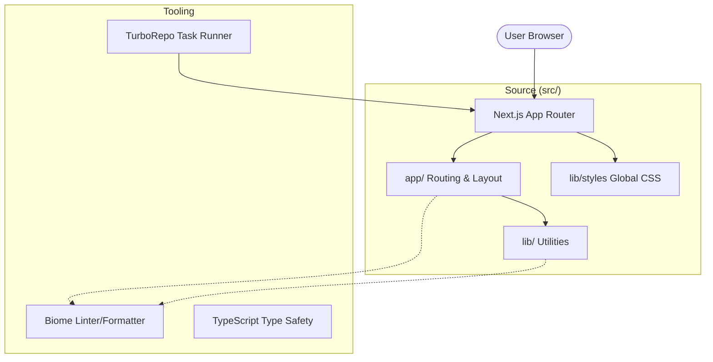

# nextarter-base
[](https://vercel.com/import/git?s=https://github.com/agustinusnathaniel/nextarter-base) [](https://app.netlify.com/start/deploy?repository=https://github.com/agustinusnathaniel/nextarter-base)

[](https://stackblitz.com/github/agustinusnathaniel/nextarter-base)


A minimalist, high-performance Next.js starter template designed for modern web development. It features a lean architecture with a focus on developer experience, type safety, and efficient tooling.

## 🚀 Overview

`nextarter-base` is a "no-fluff" foundation for building Next.js applications. It prioritizes speed, strict standards, and modern best practices using React 19 and the Next.js App Router.

### Problem it Solves
- Eliminates the boilerplate fatigue of setting up a new Next.js project.
- Enforces consistent code quality through Biome (no more ESLint/Prettier conflicts).
- Provides a high-performance build pipeline with TurboRepo.
- Ensures commit quality with Git hooks.

### High-Level Architecture



## 🛠 Tech Stack

- **Framework**: [Next.js 16 (Canary/Next)](https://nextjs.org/)
- **Library**: [React 19](https://react.dev/)
- **Linter/Formatter**: [Biome](https://biomejs.dev/)
- **Monorepo/Build Tool**: [TurboRepo](https://turbo.build/)
- **Language**: [TypeScript](https://www.typescriptlang.org/)
- **Git Hooks**: [Husky](https://typicode.github.io/husky/) + [commitlint](https://commitlint.js.org/)
- **Deployment**: Optimized for Vercel, Netlify, or Cloudflare Workers.

## 📁 Repository Structure

```text
.
├── .github/          # CI/CD Workflows
├── .husky/           # Git hooks configuration
├── src/
│   ├── app/          # App Router: Routes, Layouts, APIs
│   └── lib/          # Shared utilities and styles
│       └── styles/   # Global CSS
├── biome.json        # Biome linting and formatting rules
├── next.config.ts    # Next.js configuration
├── turbo.json        # TurboRepo task definitions
└── package.json      # Dependencies and scripts
```

## ⌨️ Development Workflows

### Prerequisites
- [Node.js](https://nodejs.org/) (Version specified in `.nvmrc`)
- [pnpm](https://pnpm.io/) (Latest version recommended)

### Getting Started

```bash
# Install dependencies
pnpm install

# Run development server
pnpm dev

# Build for production
pnpm build
```

### Common Commands

| Command | Description |
| :--- | :--- |
| `pnpm dev` | Starts development server on `localhost:3000` |
| `pnpm build` | Builds the application for production |
| `pnpm biome:check` | Checks code formatting and lint rules |
| `pnpm biome:fix` | Automatically fixes lint/format issues |
| `pnpm type:check` | Runs TypeScript compiler check |
| `pnpm release` | Creates a new tag and updates changelog |

## 🧪 Testing

This template includes a baseline Playwright setup for E2E testing.
```bash
pnpm test:e2e
```

---
Built with ❤️ by [agustinusnathaniel](https://github.com/agustinusnathaniel)
