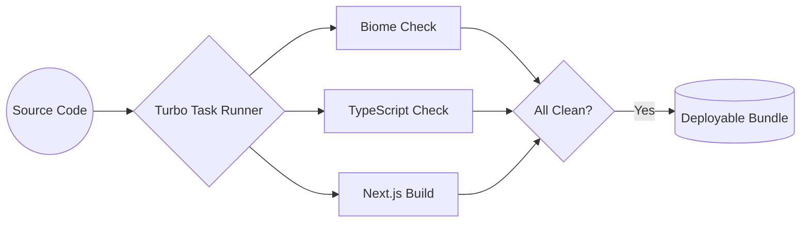

# System Specification: nextarter-base

This document defines the core concepts, architectural invariants, and technical constraints of the `nextarter-base` system.

## 🎯 Core Concepts

### 1. Zero-Config Quality
The project is designed to "just work" with high-quality defaults. This is achieved by centralizing rules in `biome.json` and `tsconfig.json`, minimizing per-file configuration.

### 2. High-Performance Build Pipeline
The system leverages **TurboRepo** to cache build artifacts and parallelize tasks (linting, type-checking, building).

### 3. Progressive Enhancement
While utilizing React 19 features like Server Components, the system maintains a focus on standard Web APIs and SEO (via `next-sitemap`).

## 🛡️ Invariants and Rules

| Category | Rule | Enforcement |
| :--- | :--- | :--- |
| **Naming** | Files must use `kebab-case`. | `biome.json` |
| **Exports** | No default exports for utilities/components. | `biome.json` |
| **Imports** | No barrel files (`index.ts` re-exports). | `biome.json` |
| **Logging** | No `console.log` (except `error`/`info`). | `biome.json` |
| **Types** | `Array<T>` generic syntax is required. | `biome.json` |
| **State** | Minimize Client Components; prefer Server Components. | Pattern |

## 🔄 Data and Build Flows

### Commit-to-Deploy Lifecycle
1. **Pre-commit**: `lint-staged` runs Biome check on staged files.
2. **Commit**: `commitlint` validates the message.
3. **CI/Build**: TurboRepo executes `build`, `biome:check`, and `type:check` in parallel.
4. **Post-build**: `next-sitemap` generates SEO assets.
5. **Release**: `commit-and-tag-version` handles versioning and changelogs.

## 🛠 External Dependencies

- **Biome**: Replaces ESLint, Prettier, and more. Used for speed and unified configuration.
- **Turbo**: Orchestrates the build process across potentially multiple packages (if scaled to monorepo).
- **Husky**: Prevents "dirty" commits by running local validation.

## ⚠️ Known Limitations & Constraints

- **Node Version**: Requires Node ^24.11.x.
- **App Router**: Exclusively uses the App Router; the `pages/` directory is not supported.
- **Global Styles**: Defined in `src/lib/styles/globals.css`. CSS Modules are preferred for component-specific styles.

## 🚫 Non-Goals

- Providing a complex UI library (Tailwind/Shadcn is not included by default to keep the base lean).
- State management heavy-lifting (Redux/Zustand not included).
- Database ORMs or backend logic (this is a frontend-focused starter).
